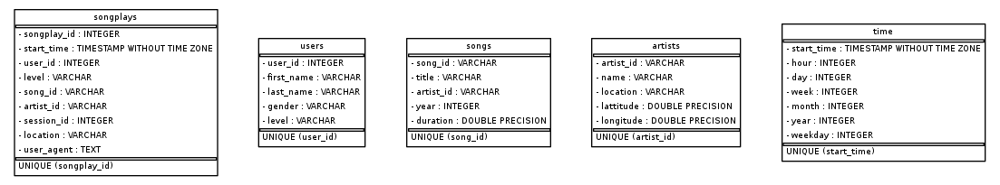

## Introduction (Data Modeling with Postgres Udacity Project 1)
A startup called Sparkify wants to analyze the data they've been collecting on songs and user activity on their new music streaming app. The analytics team is particularly interested in understanding what songs users are listening to. Currently, they don't have an easy way to query their data, which resides in a directory of JSON logs on user activity on the app, as well as a directory with JSON metadata on the songs in their app.

They'd like a data engineer to create a Postgres database with tables designed to optimize queries on song play analysis, and bring you on the project. Your role is to create a database schema and ETL pipeline for this analysis. You'll be able to test your database and ETL pipeline by running queries given to you by the analytics team from Sparkify and compare your results with their expected results.

## Project Description
In this project, you'll apply what you've learned on data modeling with Postgres and build an ETL pipeline using Python. To complete the project, you will need to define fact and dimension tables for a star schema for a particular analytic focus, and write an ETL pipeline that transfers data from files in two local directories into these tables in Postgres using Python and SQL

## Project Repository Files
- create_tables.py: Clean previous schema and creates tables.
- sql_queries.py: All queries used in the ETL pipeline.
- etl.py: Read JSON logs and JSON metadata and load the data into generated tables.

## Database Schema


- songplays: Records in log data associated with song plays
- users: Users in the app
- songs: Songs in music database
- artists: Artists in music database
- time: Timestamps of records in songplays broken down into specific units

## ETL Pipeline

### song_data ETL

Each file is in JSON format and contains metadata about a song and the artist of that song. The files are partitioned by the first three letters of each song's track ID. For example, here are filepaths to two files in this dataset.

`song_data/A/B/C/TRABCEI128F424C983.json
song_data/A/A/A/TRAAAAW128F429D538.json
`

And below is an example of what a single song file, TRAAAAW128F429D538.json, looks like.
```json
{
    num_songs:1
    artist_id:"ARD7TVE1187B99BFB1"
    artist_latitude:null
    artist_longitude:null
    artist_location:"California - LA"
    artist_name:"Casual"
    song_id:"SOMZWCG12A8C13C480"
    title:"I Didn't Mean To"
    duration:218.93179
    year:0
}
```

### Tables created from song_data

#### songs table: song ID, title, artist ID, year, and duration

| song_id            | title                          | artist_id          | year | duration  |
|--------------------|--------------------------------|--------------------|------|-----------|
| SOMZWCG12A8C13C480 | I Didn't Mean To               | ARD7TVE1187B99BFB1 | -    | 218.93179 |
| SOFFKZS12AB017F194 | A Higher Place (Album Version) | ARBEBBY1187B9B43DB | 1994 | 236.17261 |

#### artist table: artist ID, name, location, latitude, and longitude

| artist_id          | name      | location        | lattitude | longitude |
|--------------------|-----------|-----------------|-----------|-----------|
| ARD7TVE1187B99BFB1 | Casual    | California, LA  | -         | -         |
| ARBEBBY1187B9B43DB | Tom Petty | Gainesville, FL | -         | -         |

### log_data ETL

The log files in the dataset you'll be working with are partitioned by year and month. For example, here are filepaths to two files in this dataset.

`log_data/2018/11/2018-11-24-events.json
log_data/2018/11/2018-11-29-events.json
`

And below is an example of what the data in a log file, 2018-11-24-events.json, looks like.
```json
{
    "artist":"The Future Sound of London",
    "auth":"Logged In",
    "firstName":"Ryan",
    "gender":"M",
    "itemInSession":0,
    "lastName":"Smith",
    "length":405.28934,
    "level":"free",
    "location":"San Jose-Sunnyvale-Santa Clara, CA",
    "method":"PUT",
    "page":"NextSong",
    "registration":1541016707796.0,
    "sessionId":873,
    "song":"Papua New Guinea",
    "status":200,
    "ts":1543020300796,
    "userAgent":"\"Mozilla\/5.0 (X11; Linux x86_64) AppleWebKit\/537.36 (KHTML, like Gecko) Ubuntu Chromium\/36.0.1985.125 Chrome\/36.0.1985.125 Safari\/537.36\"",
    "userId":"26"
}
```

### Tables created from log_data

#### time table: timestamp, hour, day, week of year, month, year, and weekday from the ts field

| start_time                 | hour | day | week | month | year | weekday |
|----------------------------|------|-----|------|-------|------|---------|
| 2018-11-29 00:00:57.796000 | 0    | 29  | 48   | 11    | 2018 | 3       |
| 2018-11-29 00:01:30.796000 | 0    | 29  | 48   | 11    | 2018 | 3       |


#### users table: user ID, first name, last name, gender and level

| user_id | first_name | last_name | gender | level |
|---------|------------|-----------|--------|-------|
| 79      | James      | Martin    | M      | free  |
| 52      | Theodore   | Smith     | M      | free  |


#### songplays table: timestamp, user ID, level, song ID, artist ID, session ID, location, and user agent

| songplay_id | start_time                 | user_id | level | song_id | artist_id | session_id | location                            | user_agent                                                                                                              |
|-------------|----------------------------|---------|-------|---------|-----------|------------|-------------------------------------|-------------------------------------------------------------------------------------------------------------------------|
| 1           | 2018-11-29 00:00:57.796000 | 73      | paid  | -       | -         | 954        | Tampa-St. Petersburg-Clearwater, FL | "Mozilla/5.0 (Macintosh; Intel Mac OS X 10_9_4) AppleWebKit/537.78.2 (KHTML, like Gecko) Version/7.0.6 Safari/537.78.2" |
| 2           | 2018-11-29 00:01:30.796000 | 24      | paid  | -       | -         | 984        | Lake Havasu City-Kingman, AZ        | "Mozilla/5.0 (Windows NT 6.1; WOW64) AppleWebKit/537.36 (KHTML, like Gecko) Chrome/36.0.1985.125 Safari/537.36"         |
